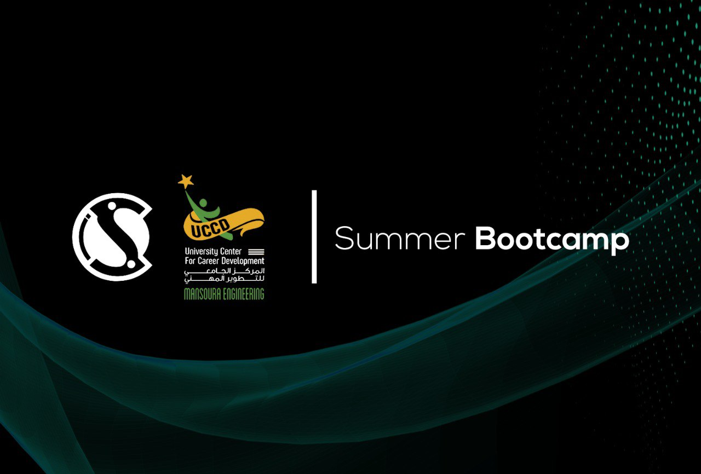

    <h1>Frontend Training Bootcamp | CIS Team</h1>
    
    
Frontend Training Bootcamp hosted by the CIS Team and UCCD, we will build some applications using what was learned in the Front-End Committee.

## Table of Contents

1. [Opening Session](#opening-session)
2. [Day 1](#day-1)
3. [Day 2](#day-2)

## Opening Session

See Opening Session Presentation from [here](https://docs.google.com/presentation/d/1DGucFk-lQCu41l-hyEI42GVZ34XeGN_Y/view)

## Day 1

On day 1, we will learn about Logical Properties in CSS.
Build a Group Page from the CIS website using HTML, CSS, and JavaScript.

> Preview Figma file from this [link ↗](https://www.figma.com/file/Ga1BxCjiJ0josvo7CzImnC/CIS-Website-Groups---Workshop)

## Day 2

Continue building the Group Page from the CIS website using HTML, CSS, and JavaScript.
